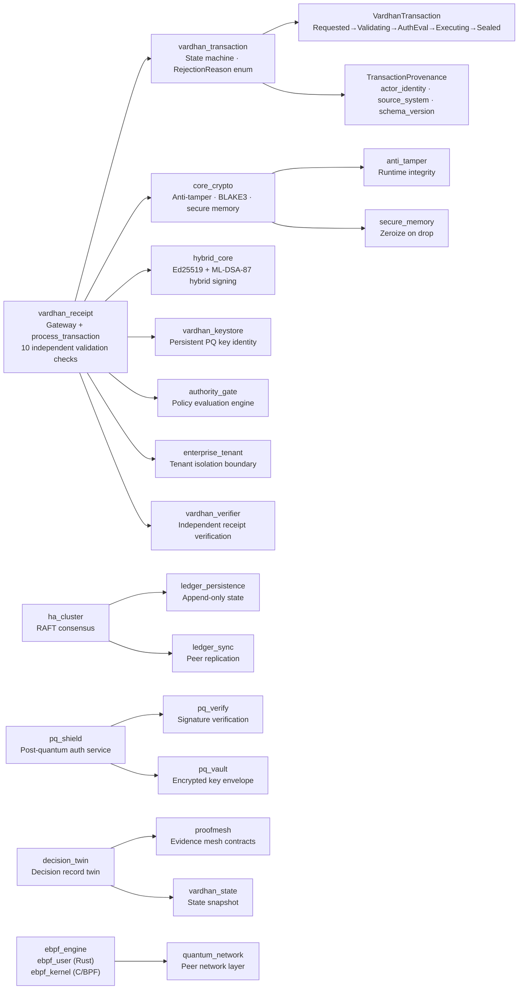
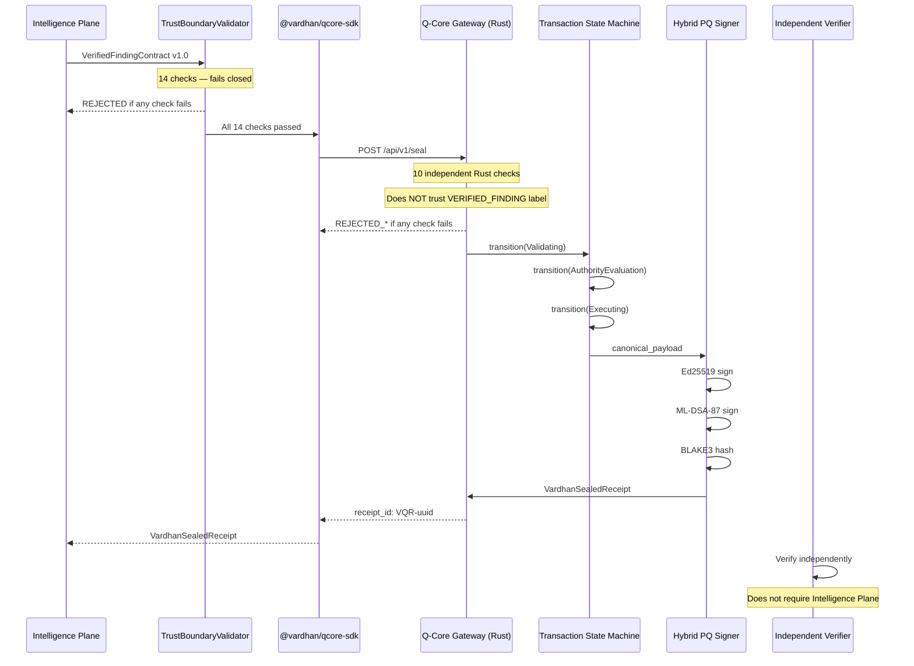

# VARDHAN Q-CORE — PLATFORM ARCHITECTURE & MIND MAP

> Commit `4811c82` · ~100,000 lines of production code

---

## Technology Stack

| Layer | Language | Why |
|---|---|---|
| **Q-Core Gateway / Sovereign Substrate** | **Rust** | Memory safety, zero-cost abstractions, `unsafe`-free cryptographic primitives, compile-time correctness |
| **Intelligence Plane engines** | **TypeScript (Node.js)** | Async I/O for concurrent web research, rich type system for evidence contracts |
| **ZK Engine** | **TypeScript + Circom** | Groth16 proof generation; Circom compiles ZK circuits to WASM/zkey |
| **SDKs** | **TypeScript + Python** | Enterprise integration mechanisms — not the product itself |
| **eBPF kernel enforcement** | **C (BPF bytecode) + Rust user-space** | Kernel-level packet filtering for Raft peer isolation (Linux only) |
| **ZK Circuits** | **Circom DSL** | Compliance circuit compiled to `.wasm` + `.zkey` for Groth16 proofs |

---

## Platform Mind Map

```mermaid
graph TD
    VARDHAN["🏛 VARDHAN PLATFORM"]

    VARDHAN --> INT["🧠 Vardhan Intelligence\nTypeScript · Node.js"]
    VARDHAN --> SOL["⚙️ Vardhan Tech Solutions\nEnterprise Engagements"]
    VARDHAN --> QC["⚛️ Vardhan Q-Core\nRust Sovereign Substrate"]

    INT --> DISC["Discovery Pipeline"]
    INT --> EVID["Evidence Layer"]
    INT --> VERIFY["Verification Layer"]
    INT --> BOUNDARY["Trust Boundary"]

    DISC --> EP["EntryPointDiscovery\nSurface mapping"]
    DISC --> GRAPH["EntryPointGraph\nEvidence-backed edges only"]
    DISC --> SEARCH["WebSearch / GitHub / Growjo\nPublic source providers"]

    EVID --> EXP["ExpectationEngine\nStructured data only — no regex"]
    EVID --> OBS["LivePublicObservationProvider\nReal HTTP observations"]
    EVID --> DIFF["DifferentialFindingEngine\nExpectation vs observation"]

    VERIFY --> FVE["FindingVerificationEngine\nProof contracts · temporal/physical gates"]
    VERIFY --> ODE["OpportunityDecisionEngine\nHypothesis-driven · no weak signals"]

    BOUNDARY --> VFC["VerifiedFindingContract v1.0\nVersioned · separated identities"]
    BOUNDARY --> TBV["TrustBoundaryValidator\n14 independent checks"]
    BOUNDARY --> QCS["QCoreIntegrationService\nContract-only API"]

    QC --> GW["Q-Core Gateway\nAxum HTTP API :8080"]
    QC --> TXN["Transaction State Machine\nRequested→Validating→Executing→Sealed"]
    QC --> CRYPTO["Cryptographic Substrate"]
    QC --> HA["HA / RAFT Cluster"]
    QC --> EBPF["eBPF Network Enforcement\nLinux kernel-level"]
    QC --> ZK["ZK Proof Engine\nGroth16 · Circom"]

    GW --> VAL["10 Independent Q-Core Checks\nSchema · Hash · Whitelist · Sentinel"]
    GW --> POL["Policy / Authority Gate\nVardhanGate"]

    CRYPTO --> ED["Ed25519 Signing\nClassical"]
    CRYPTO --> ML["ML-DSA-87 Signing\nFIPS 204 Post-Quantum"]
    CRYPTO --> BL["BLAKE3 Hash\nPayload integrity"]
    CRYPTO --> KS["Persistent Keystore\nUUID key identity · fingerprint"]

    HA --> RAFT["RAFT Consensus\nLeader election · log replication"]
    HA --> LEDGER["Ledger Persistence\nAppend-only · commit index"]

    ZK --> CIRC["Compliance Circuit\nCircom DSL"]
    ZK --> PROVER["Groth16 Prover\nWASM execution"]
    ZK --> ZVERIF["ZK Verifier\nIndependent of prover"]

    QC --> SDK_TS["TypeScript SDK\n@vardhan/qcore-sdk"]
    QC --> SDK_PY["Python SDK\nvardhan-qcore"]
```



---

## Rust Backend — 35 Crates (~47,800 lines)



---

## Intelligence Plane — Pipeline Data Flow (~39,500 lines TypeScript)

```mermaid
flowchart TD
    START["Target: Organisation Domain"]

    START --> EPD["EntryPointDiscovery\nMaps public technical surfaces"]
    EPD --> GRAPH2["EntryPointGraph\nEvidence-backed edges only\nInferred edges → evidenceIds: empty"]

    GRAPH2 --> APIOP["ApiOperationParser\nDeterministic IDs via SHA-256\nCurl header inspection — no text matching"]
    APIOP --> EXP2["ExpectationEngine\nStructured data only\nNo regex keyword matching"]

    EXP2 --> OBS2["LivePublicObservationProvider\nReal HTTP requests\nUnauthenticated probes only"]
    OBS2 --> DIFF2["DifferentialFindingEngine\nExpectation vs Observation\nProvenance gate on every expectation"]

    DIFF2 --> AIE["AdaptiveInvestigationEngine\nHypothesis-driven pivots\nNo blind WAF/4xx pivots"]
    AIE --> FVE2["FindingVerificationEngine\nTemporal gate: blocks HISTORICAL\nPhysical gate: blocks context artifacts\nContent hash verification"]

    FVE2 --> ODE2["OpportunityDecisionEngine\nRequires: strong hypothesis\nBlocks: contradicted · weak · graph-inferred"]

    ODE2 -->|"state = VERIFIED_FINDING"| VFC2["VerifiedFindingContract\nschema_version: 1.0\nSeparated identities\nEvidence content hashes"]

    VFC2 --> TBV2["TrustBoundaryValidator\n14 pre-flight checks\nFails closed — never softens"]
    TBV2 -->|"passed = true"| QCIS["QCoreIntegrationService\nSubmits to Q-Core Gateway"]

    QCIS --> QCG["Q-Core Gateway\n10 independent Rust checks\nno trust in caller label"]
    QCG --> RECEIPT["VardhanSealedReceipt\nEd25519 + ML-DSA-87 dual-signed\nBLAKE3 payload hash\nreceipt_id: VQR-uuid"]
    RECEIPT --> INDEP["Independent Verifier\nVerifies without Intelligence Plane"]
```



---

## ZK Engine — Compliance Proof Layer (~12,300 lines TypeScript + Circom)

| Package | Purpose |
|---|---|
| `zk_engine/packages/engine` | Groth16 prover, circuit inputs, WASM executor |
| `zk_engine/packages/circuit-lib` | Circom `.circom` → `.wasm` + `.zkey` build pipeline |
| `zk_engine/packages/proof-format` | Canonical proof envelope, ABI encoding, Poseidon hash |
| `zk_engine/packages/keys` | ZK keypair, keyring, keystore management |
| `zk_engine/packages/api` | Redis job queue, REST API for proof requests |
| `zk_engine/packages/cli` | CLI for proof generation and verification |
| `zk_engine/packages/dashboard` | Proof status dashboard UI |

---

## Trust Boundary — Full Separation Model



---

## Identity Separation (Enforced)

```
IntelligenceIdentity
  engine_id:      "vardhan-intelligence-v2"   ← engine instance
  engine_version: "2.0.0"                     ← semver
  run_id:         "run_20261003"              ← this research run

OrganizationIdentity                           ← customer org (maps to tenant_id)
  organization_id: "org-acme"
  canonical_domain: "acme.com"

ResourceIdentity                               ← the specific thing being assessed
  canonical_url: "https://api.acme.com/v1/data"
  surface_type:  "API_REST"
  entry_point_id: "ep_01"

Q-Core Authority Reference                     ← the policy gate that evaluated
  "gate:VardhanGate:VARDHAN_CORE_INTELLIGENCE_POLICY_V1"
```

These four identities **must never be conflated.** The validator and Q-Core enforce this at boundary crossing.

---

## What Is and Is Not Implemented

### ✅ Implemented and tested

- Post-quantum hybrid signing (Ed25519 + ML-DSA-87)
- BLAKE3 payload hash on every receipt
- Transaction state machine (4 states, typed transitions)
- RAFT consensus cluster
- 14-check TypeScript trust boundary validator (29/29 tests passing)
- 10-check Rust Q-Core independent validation
- Evidence content hash tamper detection
- Sentinel source_identity rejection in Rust
- Deterministic intelligence artifact IDs (SHA-256, no `Math.random()`)
- Context artifact isolation (physical verification gate)
- Historical evidence isolation (temporal gate)
- Evidence smearing prevention (graph inferred edges carry no evidenceIds)
- TypeScript SDK + Python SDK
- ZK compliance circuit (Groth16 prover + verifier)
- eBPF network enforcement (Linux; simulation mode on macOS)

### ⚠️ Partially implemented

| Gap | Status |
|---|---|
| Persistent keystore wired into gateway signing | Keystore crate exists; gateway still generates ephemeral keys per request |
| Dynamic policy registry | Static whitelist in Rust; policy crate exists but not integrated |
| Contradictory evidence auto-rejection at trust boundary | Documented gap; handled upstream in OpportunityDecisionEngine |
| RAFT cluster in production network config | Functional in tests; Docker/production network config needs verification |

---

## Commit History Note

All Intelligence + Q-Core changes are in a **single logical commit** per the single-commit rule. The trust boundary hardening commit is `4811c82`.

To inspect the full diff:
```bash
git show 4811c82 --stat
```
