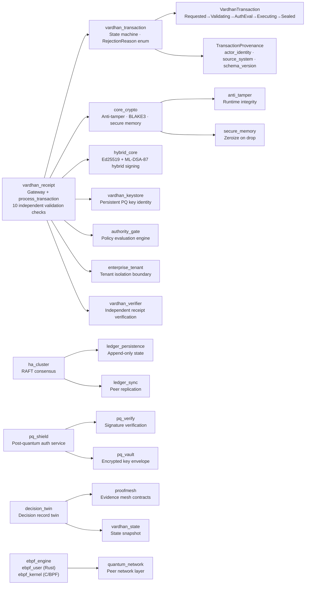
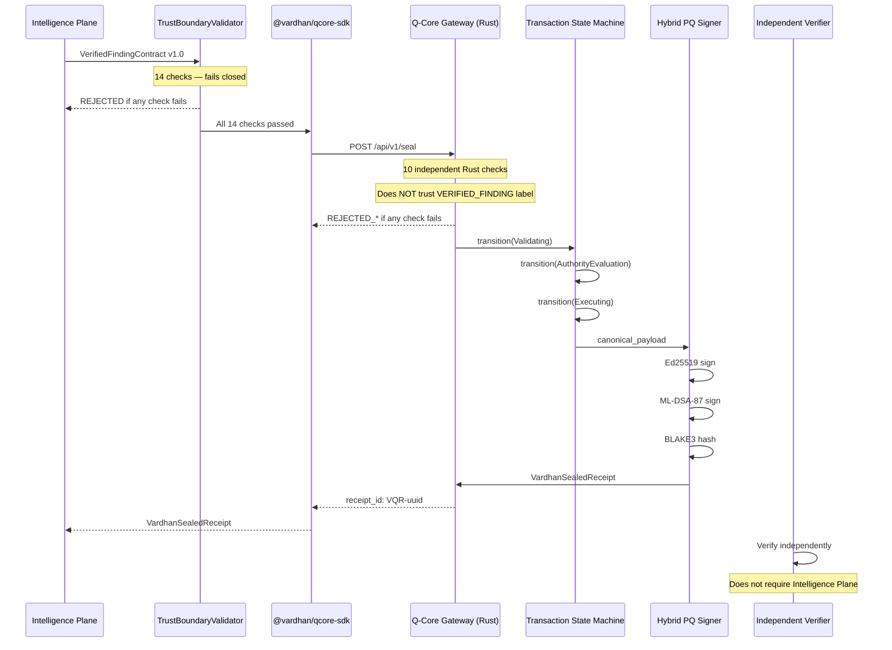

# VARDHAN Q-CORE PLATFORM

> **High-assurance cryptographic infrastructure for governing consequential digital operations in Fortune 500 enterprises, major banks, and regulated industries.**

📚 **[View the Full Architecture & Mind Maps (ARCHITECTURE.md)](ARCHITECTURE.md)**

---

## Overview

Vardhan Q-Core is a sovereign-grade enterprise infrastructure platform. It governs high-stakes digital operations by producing independently verifiable cryptographic proof of every decision, transaction, and state change — without requiring trust in any single node, service, or identity.

Q-Core is not a developer SaaS product. It is infrastructure for organisations where the cost of a wrong decision, an unverifiable audit trail, or a compromised identity is measured in regulatory exposure, systemic risk, or reputational damage at scale.

---

## Architecture

The platform is structured as three independent pillars:

```mermaid
graph TD
    VARDHAN["🏛 VARDHAN PLATFORM"]

    VARDHAN --> INT["🧠 Vardhan Intelligence\nTypeScript · Node.js"]
    VARDHAN --> SOL["⚙️ Vardhan Tech Solutions\nEnterprise Engagements"]
    VARDHAN --> QC["⚛️ Vardhan Q-Core\nRust Sovereign Substrate"]

    INT --> DISC["Discovery Pipeline"]
    INT --> EVID["Evidence Layer"]
    INT --> VERIFY["Verification Layer"]
    INT --> BOUNDARY["Trust Boundary"]

    DISC --> EP["EntryPointDiscovery\nSurface mapping"]
    DISC --> GRAPH["EntryPointGraph\nEvidence-backed edges only"]
    DISC --> SEARCH["WebSearch / GitHub / Growjo\nPublic source providers"]

    EVID --> EXP["ExpectationEngine\nStructured data only — no regex"]
    EVID --> OBS["LivePublicObservationProvider\nReal HTTP observations"]
    EVID --> DIFF["DifferentialFindingEngine\nExpectation vs observation"]

    VERIFY --> FVE["FindingVerificationEngine\nProof contracts · temporal/physical gates"]
    VERIFY --> ODE["OpportunityDecisionEngine\nHypothesis-driven · no weak signals"]

    BOUNDARY --> VFC["VerifiedFindingContract v1.0\nVersioned · separated identities"]
    BOUNDARY --> TBV["TrustBoundaryValidator\n14 independent checks"]
    BOUNDARY --> QCS["QCoreIntegrationService\nContract-only API"]

    QC --> GW["Q-Core Gateway\nAxum HTTP API :8080"]
    QC --> TX["Transaction State Machine\nRequested→Validating→Executing→Sealed"]
    QC --> CRYPTO["Cryptographic Substrate"]
    QC --> HA["HA / RAFT Cluster"]
    QC --> EBPF["eBPF Network Enforcement\nLinux kernel-level"]
    QC --> ZK["ZK Proof Engine\nGroth16 · Circom"]

    GW --> VAL["10 Independent Q-Core Checks\nSchema · Hash · Whitelist · Sentinel"]
    GW --> POL["Policy / Authority Gate\nVardhanGate"]

    CRYPTO --> ED["Ed25519 Signing\nClassical"]
    CRYPTO --> ML["ML-DSA-87 Signing\nFIPS 204 Post-Quantum"]
    CRYPTO --> BL["BLAKE3 Hash\nPayload integrity"]
    CRYPTO --> KS["Persistent Keystore\nUUID key identity · fingerprint"]

    HA --> RAFT["RAFT Consensus\nLeader election · log replication"]
    HA --> LEDGER["Ledger Persistence\nAppend-only · commit index"]

    ZK --> CIRC["Compliance Circuit\nCircom DSL"]
    ZK --> PROVER["Groth16 Prover\nWASM execution"]
    ZK --> ZVERIF["ZK Verifier\nIndependent of prover"]

    QC --> SDK_TS["TypeScript SDK\n@vardhan/qcore-sdk"]
    QC --> SDK_PY["Python SDK\nvardhan-qcore"]
```



Each pillar has its own commercial model, identity, and responsibility boundary. They are not conflated.

### Rust Backend Structure (~47,800 lines)



### Intelligence Pipeline Data Flow (~39,500 lines)

```mermaid
flowchart TD
    START["Target: Organisation Domain"]

    START --> EPD["EntryPointDiscovery\nMaps public technical surfaces"]
    EPD --> GRAPH2["EntryPointGraph\nEvidence-backed edges only\nInferred edges → evidenceIds: empty"]

    GRAPH2 --> APIOP["ApiOperationParser\nDeterministic IDs via SHA-256\nCurl header inspection — no text matching"]
    APIOP --> EXP2["ExpectationEngine\nStructured data only\nNo regex keyword matching"]

    EXP2 --> OBS2["LivePublicObservationProvider\nReal HTTP requests\nUnauthenticated probes only"]
    OBS2 --> DIFF2["DifferentialFindingEngine\nExpectation vs Observation\nProvenance gate on every expectation"]

    DIFF2 --> AIE["AdaptiveInvestigationEngine\nHypothesis-driven pivots\nNo blind WAF/4xx pivots"]
    AIE --> FVE2["FindingVerificationEngine\nTemporal gate: blocks HISTORICAL\nPhysical gate: blocks context artifacts\nContent hash verification"]

    FVE2 --> ODE2["OpportunityDecisionEngine\nRequires: strong hypothesis\nBlocks: contradicted · weak · graph-inferred"]

    ODE2 -->|"state = VERIFIED_FINDING"| VFC2["VerifiedFindingContract\nschema_version: 1.0\nSeparated identities\nEvidence content hashes"]

    VFC2 --> TBV2["TrustBoundaryValidator\n14 pre-flight checks\nFails closed — never softens"]
    TBV2 -->|"passed = true"| QCIS["QCoreIntegrationService\nSubmits to Q-Core Gateway"]

    QCIS --> QCG["Q-Core Gateway\n10 independent Rust checks\nno trust in caller label"]
    QCG --> RECEIPT["VardhanSealedReceipt\nEd25519 + ML-DSA-87 dual-signed\nBLAKE3 payload hash\nreceipt_id: VQR-uuid"]
    RECEIPT --> INDEP["Independent Verifier\nVerifies without Intelligence Plane"]
```



---

## Q-Core: Core Capabilities

| Capability | Status |
|---|---|
| Post-quantum hybrid signing (Ed25519 + ML-DSA-87 / FIPS 204) | ✅ Implemented |
| BLAKE3 payload integrity | ✅ Implemented |
| Dual-signature sealed receipts | ✅ Implemented |
| Transaction state machine (Requested → Validating → Executing → Sealed) | ✅ Implemented |
| Persistent signing keystore with key identity and fingerprint | ✅ Implemented |
| Idempotency / replay protection | ✅ Implemented |
| Independent verifier (separate from issuer) | ✅ Implemented |
| Q-Core Gateway (Axum HTTP API) | ✅ Implemented |
| TypeScript SDK (`@vardhan/qcore-sdk`) | ✅ Implemented |
| Python SDK (`vardhan-qcore`) | ✅ Implemented |
| HA / RAFT cluster consensus | ✅ Implemented |
| Tenant isolation | ✅ Implemented |
| eBPF network enforcement layer (Linux) | ✅ Implemented (Linux; simulation mode on macOS) |
| Intelligence → Q-Core trust boundary with contract validation | ✅ Implemented |

---

## Intelligence → Q-Core Trust Boundary

The Intelligence Plane and Q-Core are independently distrustful of each other.

### Trust Boundary Sequence



**A `VERIFIED_FINDING` label from the Intelligence Plane is not the trust decision.** Q-Core validates the contract content independently. Both layers reject on the same failure.

---

## Identity Model

The following identities are explicitly separated and never conflated:

| Identity | Field | Purpose |
|---|---|---|
| Intelligence Engine | `intelligence.engine_id` | The specific engine version that produced the finding |
| Organisation | `organization.organization_id` | The customer organisation being assessed |
| Q-Core Tenant | `tenant_id` (in request) | The governed tenant in Q-Core |
| Affected Resource | `affected_resource.canonical_url` | The specific physical resource |
| Authority | `authority_reference` in receipt | The gate that evaluated policy |

---

## API Reference

### Seal a Finding

```
POST /api/v1/seal
Content-Type: application/json

{
  "tenant_id": "<organisation-id>",
  "finding_id": "<deterministic-finding-id>",
  "provenance": {
    "source_identity": "<engine-id>",
    "timestamp": "<ISO-8601>",
    "version": "<semver>"
  },
  "evidence_package": {
    "evidence_id": "ev_pkg_<finding-id>",
    "data_hash": "<64-char-sha256-hex>",
    "category": "<technical-area>"
  },
  "decision_candidate": {
    "action_type": "SEAL_VERIFIED_FINDING",
    "policy_reference": "VARDHAN_CORE_INTELLIGENCE_POLICY_V1"
  }
}
```

**Response (200 OK):**

```json
{
  "receipt_id": "VQR-<uuid>",
  "schema_version": "1.0",
  "transaction_id": "<uuid>",
  "status": "SEALED",
  "tenant_id": "<org-id>",
  "subject_id": "<finding-id>",
  "actor_identity": "<engine-id>",
  "proposed_action": "SEAL_VERIFIED_FINDING",
  "policy_id": "VARDHAN_CORE_INTELLIGENCE_POLICY_V1",
  "policy_version": "1.0",
  "decision": "AUTHORIZED",
  "outcome_code": "SEALING_OK",
  "payload_hash": "<blake3-hex>",
  "issuer_key_fingerprint": "<blake3-hex>",
  "signatures": {
    "ed25519_sig": "<hex>",
    "ed25519_key_id": "<uuid>",
    "ml_dsa_87_sig": "<hex>",
    "ml_dsa_87_key_id": "<uuid>"
  },
  "timestamp_ms": 1234567890000,
  "ledger_commit_index": 1
}
```

**Error responses** return HTTP 400 with a structured rejection code (e.g. `REJECTED_TENANT_INVALID`, `REJECTED_EVIDENCE_HASH_INVALID`, `REJECTED_POLICY_UNKNOWN`).

---

## SDK Usage

### TypeScript

```typescript
import { QCoreClient } from '@vardhan/qcore-sdk';

const client = new QCoreClient('https://your-qcore-instance:8080');

const receipt = await client.sealTransaction({
  tenant_id: 'org-your-company',
  finding_id: 'find_abc123',
  provenance: {
    source_identity: 'vardhan-intelligence-v2',
    timestamp: new Date().toISOString(),
    version: '2.0.0',
  },
  evidence_package: {
    evidence_id: 'ev_pkg_find_abc123',
    data_hash: '<sha256-of-sorted-evidence-content-hashes>',
    category: 'Authorization',
  },
  decision_candidate: {
    action_type: 'SEAL_VERIFIED_FINDING',
    policy_reference: 'VARDHAN_CORE_INTELLIGENCE_POLICY_V1',
  },
});

console.log(receipt.receipt_id); // VQR-<uuid>
```

### Python

```python
from vardhan_qcore import QCoreClient

client = QCoreClient(base_url="https://your-qcore-instance:8080")
receipt = client.seal_transaction({
    "tenant_id": "org-your-company",
    "finding_id": "find_abc123",
    # ... same fields as TypeScript
})
```

---

## Running Locally

### Prerequisites

- Rust 1.78+ with `cargo`
- Node.js 20+
- (Optional) Docker for containerised deployment

### Start the Q-Core Gateway

```bash
cd "backend/vardhan_receipt"
cargo run -- serve --port 8080
```

Gateway will be available at `http://localhost:8080`. Health check: `GET /health`.

### Run the Intelligence Plane

```bash
cd intelligence_plane
npm install
npm run vardhan
```

### Run the Trust Boundary Tests

```bash
cd intelligence_plane
npx tsx tests/trust_boundary.test.ts
# Expected: 29 passed, 0 failed
```

### TypeScript Type Check

```bash
cd intelligence_plane
npx tsc --noEmit
# Expected: clean exit
```

---

## Repository Structure

```
Vardhan Q Core/
│
├── backend/
│   ├── vardhan_receipt/        # Q-Core Gateway + transaction engine
│   ├── vardhan_transaction/    # Transaction state machine
│   ├── vardhan_keystore/       # Persistent PQ signing keystore
│   ├── core_crypto/            # Cryptographic primitives + anti-tamper
│   ├── ha_cluster/             # RAFT consensus layer
│   ├── authority_gate/         # Authority evaluation engine
│   ├── enterprise_tenant/      # Tenant isolation
│   └── ebpf_engine/            # eBPF network enforcement (Linux)
│
├── intelligence_plane/
│   └── src/server/
│       ├── VerifiedFindingContract.ts   # Versioned finding contract
│       ├── TrustBoundaryValidator.ts    # 14-check pre-flight validator
│       ├── QCoreIntegrationService.ts   # Hardened integration service
│       ├── ExpectationEngine.ts         # Evidence-backed expectation generation
│       ├── FindingVerificationEngine.ts # Physical/temporal verification
│       ├── OpportunityDecisionEngine.ts # Hypothesis-driven decision
│       ├── DifferentialFindingEngine.ts # Expectation vs observation diff
│       ├── EntryPointGraph.ts           # Evidence-backed graph (no heuristic smearing)
│       └── ApiOperationParser.ts        # Deterministic operation ID generation
│
└── sdks/
    ├── typescript/vardhan-qcore/        # @vardhan/qcore-sdk
    └── python/                          # vardhan-qcore Python SDK
```

---

## Security Properties

The following properties are implemented and tested. They are not marketing claims.

| Property | Evidence |
|---|---|
| Deterministic IDs (no random identifiers in intelligence artefacts) | `createHash('sha256')` used throughout parser and expectation engine |
| Context artifact isolation | `is_context_artifact` check blocks context docs from physical verification |
| Historical evidence isolation | `temporal_status === 'HISTORICAL'` blocked at validator and verification engine |
| Evidence content tamper detection | SHA-256 content hash recomputed and compared at trust boundary |
| Hardcoded sentinel rejection | `"intelligence_plane_engine"` and other sentinels rejected by Q-Core V5 |
| No evidence smearing via graph edges | Inferred graph edges carry `evidenceIds: []` — cannot satisfy proof contracts |
| Dual post-quantum signatures on receipts | Ed25519 + ML-DSA-87 on every sealed receipt |
| Action and policy whitelisting at Q-Core | Only `SEAL_VERIFIED_FINDING` and `VARDHAN_CORE_INTELLIGENCE_POLICY_V1` accepted |

### Known Limitations

- Key material is generated ephemerally per request. A persistent keystore integration is implemented (`vardhan_keystore`) but not yet wired into the gateway signing path.
- The contradictory evidence check at the trust boundary documents the presence of contradictions but does not auto-reject — this decision is handled upstream by `OpportunityDecisionEngine`.
- The RAFT cluster and eBPF enforcement layer are functional but require a Linux kernel environment for full production behaviour.
- The policy registry is currently a static whitelist. A dynamic policy registry is not yet implemented.

---

## Pricing (Enterprise)

Q-Core is not sold as SaaS. It is licensed as enterprise infrastructure.

| Tier | Description | Price |
|---|---|---|
| Proof-of-Concept | 90-day governed deployment with evidence contracts and sealed receipts | From £1,000,000 |
| Annual License | Full production deployment, multi-tenant, HA cluster | From £25,000,000 / year |
| Transformation Engagement (Tech Solutions) | Engineering modernisation with Q-Core as the assurance layer | From £250,000 |

Contact: vishnu@vardhan.co.uk

---

## Licence

Proprietary. All rights reserved. © Vardhan Intelligence Ltd.
